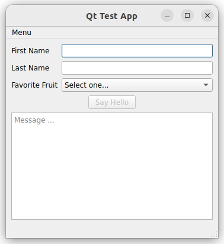
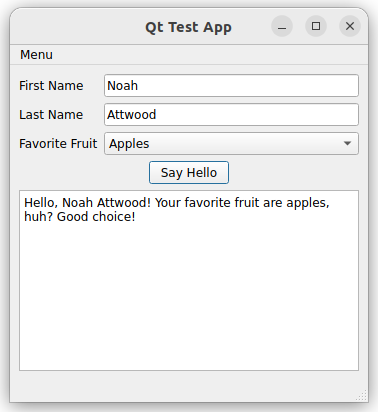

# Qt C++ Test App

A basic Qt app made using C++.

## Installing Dependencies

To install the project dependencies, please run the following commands in the project root directory:

```
# initialize the vcpkg submodule
git submodule update --init

# install vcpkg dependencies
sudo apt install -y curl pkg-config

# install qt5 dependencies
sudo apt install -y '^libxcb.*-dev' libx11-xcb-dev libgl1-mesa-dev libxrender-dev libxi-dev libxkbcommon-dev libxkbcommon-x11-dev

# build vcpkg without information collection
./vcpkg/bootstrap-vcpkg.sh -disableMetrics

# install qt5
./vcpkg/vcpkg install qt5-base
```

## Building and Running the App

Once the project dependencies have been installed, the app can be built and run by executing the following commands from the project root directory:

```
# build the Qt Test App
mkdir build && cd build
cmake ..
make

# run the Qt Test App
./bin/main
```

## Using the App

Fill in your first and last name, and select your favorite fruit from the drop-down menu (apples, bananas, oranges). When the given user input is determined to be valid, the `Say Hello` button becomes enabled. Pressing the `Say Hello` button outputs a message to the text box below.

<p align="center">
    
    &nbsp;&nbsp;&nbsp;&nbsp;
    &nbsp;&nbsp;&nbsp;&nbsp;
    
</p>
